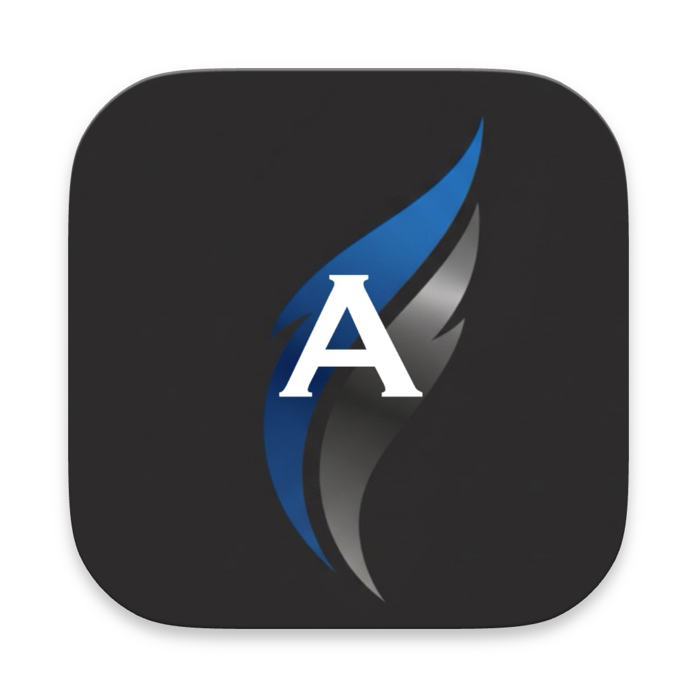

#  Athena AI Assistant

**Demo Video Coming Soon**

---

## The Most Advanced AI Assistant for macOS

Athena is a floating AI assistant that brings together cutting-edge voice processing, comprehensive system automation, and intelligent AI integration. Built for power users who need seamless AI interaction with their computer.

## Upcoming Features
- [ ] Edit notes
- [ ] Create, edit, and delete calendar events
- [ ] More to come!

## 🚀 Core Capabilities

### Voice Processing & Wake Word Detection
- **Custom Voice Activity Detection (VAD)**: Intelligent silence detection with configurable timeouts, preventing false triggers while maintaining responsiveness
- **Continuous Wake Word Recognition**: Always-listening "Athena" detection using on-device speech recognition for privacy and low latency
- **Real-Time Speech-to-Text**: Streaming transcription with partial results, supporting dictation-optimized speech recognition
- **Multi-Stage Speech Pipeline**: Sophisticated audio processing pipeline with error recovery and state management

### AI Integration & Tool Calling
- **Multi-Provider Support**: Seamless integration with Anthropic Claude and OpenAI GPT models
- **Advanced Tool Calling**: Provider-specific adapters enabling AI agents to interact with your system through structured tool calls
- **Streaming Responses**: Real-time response streaming with proper state management and error handling
- **Secure Authentication**: Enterprise-grade API key management using macOS Keychain

### System Automation Framework
- **Comprehensive File Operations**: Create, read, edit, delete, and list files with full permission handling
- **System Control Integration**: Direct control over brightness, volume, and other system settings via AppleScript
- **Application Management**: Open, close, activate, and monitor running applications programmatically
- **Accessibility Integration**: Screen and window information access for intelligent automation

### Calendar & Productivity
- **Full Google Calendar Integration**: Complete CRUD operations on calendar events with attendee management
- **Rich Calendar Visualization**: Timeline-based day view with overlapping event handling and current time indicators
- **Event Search & Management**: Advanced event querying with date range filtering and attendee tracking

### Rich Text & Note Taking
- **Custom NSTextView Integration**: Full Cocoa text system with rich formatting capabilities
- **Checkbox List Support**: Markdown-style task management with automatic formatting
- **Persistent Note Storage**: SQLite-backed note management with conversation threading

## 🏗️ Technical Architecture

### Frontend (SwiftUI + AppKit)
- **Floating Utility Window**: Always-on-top, borderless window (470x640) with no dock presence
- **Modern SwiftUI Interface**: Clean chat interface with streaming message support
- **AppKit Integration**: Native macOS integration for system-level functionality
- **Secure Configuration**: Centralized configuration management with Keychain storage

### Backend (Python FastAPI)
- **Provider Orchestration**: Unified API for multiple AI providers with consistent interfaces
- **Tool Execution Engine**: Robust tool calling framework with result formatting and error handling
- **Async Processing**: Full async/await implementation for high-performance concurrent operations

### Speech Processing Pipeline
- **Audio Input Engine**: Custom AVAudioEngine implementation with frame-based audio processing
- **Transcription Services**: Apple Speech Framework integration with on-device processing for privacy
- **State Management**: Comprehensive pipeline state management with error recovery and lifecycle handling

### Data Persistence
- **SQLite with GRDB**: High-performance database layer with migrations and relationship management
- **Conversation History**: Full conversation persistence with search and organization
- **Secure Storage**: Keychain-based API key management with proper entitlements

## 🔧 What Makes Athena Different

### Privacy-First Design
- **On-Device Speech Processing**: Wake word detection and transcription happen locally
- **No Cloud Dependencies**: Core functionality works without internet connectivity
- **Secure Key Management**: API keys never stored in plain text or transmitted insecurely

### Developer-Grade Architecture
- **Modular Design**: Clean separation of concerns with protocol-based architecture
- **Comprehensive Error Handling**: Robust error recovery throughout all subsystems
- **Extensible Tool Framework**: Easy addition of new AI providers and system integrations

### Production-Ready Implementation
- **Enterprise Security**: Proper entitlement management and sandboxing
- **Performance Optimized**: Efficient audio processing and memory management
- **Accessibility Compliant**: Full VoiceOver support and accessibility integration

## 🚀 Planned Features

We're building toward comprehensive computer automation that will make Athena the most capable AI assistant available:

### Computer Use & Automation
- **Visual Screen Understanding**: AI agents that can see and understand your screen
- **Mouse & Keyboard Control**: Programmatic interaction with any application
- **Workflow Automation**: Complex multi-step task execution across applications
- **Smart Application Switching**: Context-aware app management and window handling

### Advanced AI Integration
- **Local Model Support**: Ollama integration for offline AI capabilities
- **Multi-Modal Processing**: Image and document understanding
- **Custom Model Fine-Tuning**: Specialized models for individual user workflows

### Enhanced Productivity Features
- **Meeting Intelligence**: Real-time meeting transcription and summarization
- **Smart Scheduling**: AI-powered calendar management and conflict resolution
- **Document Processing**: Intelligent document analysis and information extraction

### Expanded System Integration
- **Spotify Control**: Music playback and playlist management
- **Email Integration**: Intelligent email processing and response generation
- **Browser Automation**: Web interaction and information retrieval

## 🛠️ Setup & Installation

### Prerequisites
- macOS 14.0+
- Xcode 15.0+
- Python 3.10+

### Quick Start
1. **Install Dependencies**
   ```bash
   cd Backend && pip install -r requirements.txt
   ```

2. **Configure API Keys**
   - Launch Athena and navigate to Settings
   - Add your Anthropic or OpenAI API keys (stored securely in Keychain)

3. **Start Backend**
   ```bash
   cd Backend && python main.py
   ```

4. **Run Athena**
   - Open in Xcode and build (⌘R)

### Voice Setup
- Grant microphone permissions when prompted
- Say "Athena" to wake the assistant
- Grant accessibility permissions for full system automation

## 🎯 Use Cases

### For Developers
- **Code Assistance**: Voice-driven code writing and debugging
- **System Automation**: Automate development workflows and environment setup
- **Documentation**: Voice-to-text documentation and note-taking

### For Productivity Professionals
- **Meeting Management**: Real-time transcription and action item extraction
- **Task Automation**: Voice-controlled calendar and email management
- **Research & Analysis**: Intelligent information gathering and synthesis

### For Power Users
- **System Control**: Voice-activated system settings and application management
- **Workflow Orchestration**: Complex multi-application task execution
- **Personal Assistant**: Comprehensive digital life management

## 📈 Performance & Reliability

- **Sub-100ms Wake Word Detection**: Optimized continuous recognition pipeline
- **Real-Time Speech Processing**: Streaming transcription with minimal latency
- **Enterprise-Grade Stability**: Comprehensive error handling and recovery mechanisms
- **Resource Efficient**: Low CPU/memory footprint for 24/7 operation

---

Athena represents the future of AI assistance - a seamless blend of voice interaction, system automation, and intelligent AI capabilities that adapts to your workflow rather than forcing you to adapt to it.
